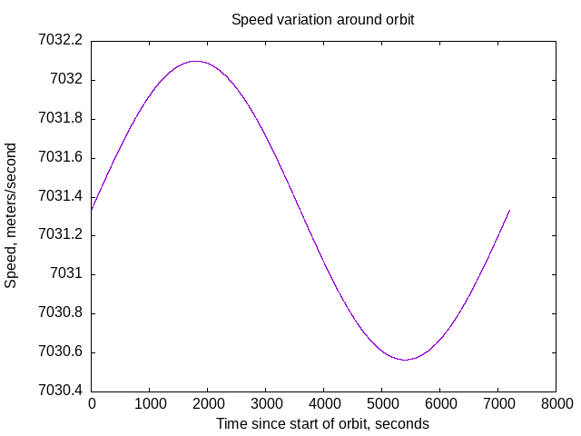
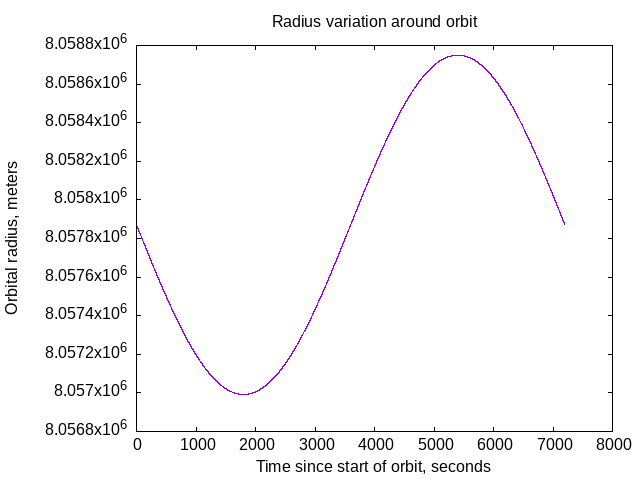

# Ground track of an earth orbiting satellite

I would like a ground track of Wernher von Braun's
1952 Space Station from [Across the Space Frontier]().
It's in a 1075 mile high, circular orbit inclined at 66.5&deg; to the equator.

The interesting thing about a ground track is that the satellite's orbit
is stable in XYZ cartesian coordinates,
but the earth rotates underneath it.

## Process

1. Write a computer program to simulate a 1075 mile high, 66.5&deg; inclined, circular orbit.
See if the program is numerically stable for several days of simulated time.
    - [code](circularorbit.go)
2. Figure out how to map (X,Y,Z) orbital positions to longitude/latitude
If the satellite is at (X,Y,Z) coords with origin at the center of
the earth, Z-axis points north, X-axis points out at 0&deg; longitude
    - longitude = math.Atan2(Y, X)
    - latitude = math.Atan2(Z, &#8730;(X2 + Y2))
Using Go's `math.Atan2()` should get positive latitude in northern hemisphere,
negative latitude in southern hemisphere.
Go's `math.Remainder()` worked to keep the longitude between -180&deg; and 180&deg;
    - [code](longlat.go)
3. Produce an image of a flattened-out ground track on a non-rotating earth.
Map (longitude, latitude) to (X,Y) coordinates in the image.
    - [code](llearth.go)
4. Produce an image of a flattened-out ground track on a rotating earth.
    - [code](llrotearth.go)
    - Go's `math.Remainder(float64, float64)` pivotal
5. Figure out how to do a [Hammer projection]() of the ground track
on a rotating earth.
    - [code](llrotearthhammer.go)

### Coastline Data

https://www.naturalearthdata.com/downloads/10m-physical-vectors/

### Verifying Numerical Integration

- For a circular orbit, inclined or equatorial,
the magnitude of the satellite's velocity should remain constant.

Minimum speed 7030 meters/second, maximum speed 7032 meters/second.
That's pretty close to constant all the way around the orbit.

- A circular orbit should have a constant radius.

Minimum radius 8058750 meters, maximum radius 8056992,
a difference of 1758 meters.

I think this is an ellipse with eccentricity of 0.0002,
which is pretty much a circle.

- The orbit should form a closed circle.
